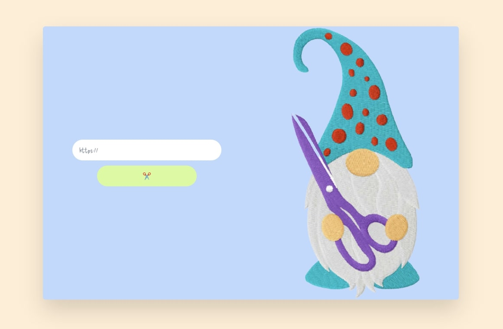

# DevProjects - Link shortener website

This is an open source project from [DevProjects](http://www.codementor.io/projects). Feedback and questions are welcome!
Find the project requirements here: [Link shortener website](https://www.codementor.io/projects/web/link-shortener-website-brqjanf6zq)

## Tech/framework used
Built Using:
* [Svelte](https://svelte.dev/)
* [Tailwind CSS](https://tailwindcss.com/)
* [Google Fonts](https://fonts.google.com/)
* [svelte-copy](https://github.com/ghostdevv/svelte-copy)

## Screenshot


## Installation
Once you've cloned the project and installed dependencies with `npm install` (or `pnpm install` or `yarn`), start a development server:

```bash
npm run dev

# or start the server and open the app in a new browser tab
npm run dev -- --open
```

You can preview the production build with `npm run preview`.

> To deploy your app, you may need to install an [adapter](https://kit.svelte.dev/docs/adapters) for your target environment.


## License
[MIT](https://choosealicense.com/licenses/mit/)
Most open source projects use the MIT license. Feel free to choose whichever license you prefer.